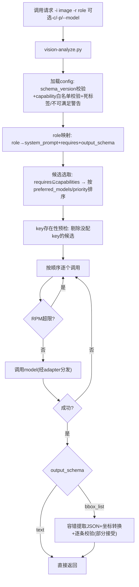

# vision-engine 详细设计文档

> 状态：代码已实现并经mock端到端测试验证，尚未接入真实API/真实agent运行时。
> 替代原`vision-analyzer`（已废弃，直接替换，无兼容层）。

---

## 1. 项目背景与目标

### 1.1 从何而来

原`vision-analyzer`是一个单模型、无fallback的视觉分析CLI，配合opencode的`vision-helper` subagent使用。存在的核心问题：

- 单模型硬编码（MiniMax-M3），配额耗尽即整体不可用
- Sub-agent与CLI两套逻辑并存，跨平台（opencode/claude code/codex）行为不一致
- 无坐标/grounding能力，无法满足"找出某元素精确位置"类需求
- 无结构化I/O、无审计、无并发控制

### 1.2 设计目标

1. **多模型容灾**：候选池+优先级+自动fallback，单个provider挂了不影响整体可用性。
2. **一张图可能包含多种性质内容**（UI/2D/3D/地图/特效/文字），不能靠调用前分类，模型自己分层输出。
3. **坐标能力分级**：相对描述任何模型都能给，精确bounding box只信任经过grounding训练的模型，且不同模型的坐标表达习惯不同，由适配层转换，不强迫模型改变原生表达方式。
4. **配置驱动**：模型列表、路由偏好、坐标约定、能力白名单全部在json里，不硬编码在代码里；"用哪个model"是可配置项，不是写死的选择逻辑。
5. **安全默认**：API key不进配置文件、不进日志、不在报错里回显。
6. **可验证**：capability标签（尤其`grounding`）不能只凭provider文档宣称，要有实测工具。

---

## 2. 整体架构



核心分流点：`text`类role（comprehensive/quick/ocr/code/compare）与`bbox_list`类role（locate）走同一套候选选取+fallback逻辑，但`bbox_list`不做"退化到通用模型"的兜底——非grounding模型的坐标是编的，混进fallback只会污染结果。`locate-ui`是例外，见2.1。

### 2.1 locate-ui 的特殊性

`locate-ui`不走上面的多模型fallback链——它对接的是OmniParser这类专用UI检测服务，语义是"枚举画面全部可交互元素"而非"回答一个自然语言查询"。当前只有一个候选（`omniparser-local`），**没有fallback**，这是接受的架构限制，不是遗漏：调用前做健康检查（`/health`），服务不可用直接报错退出，不必等真正调用超时才发现。

`-p`参数在这个role下不传给模型，而是本地对返回的元素列表做关键词匹配过滤；匹配不到时返回全部元素+`filter_matched:false`+`note`提示，不会静默返回空数组误导调用方以为"元素不存在"。

---

## 3. Role 体系

| role | requires | output_schema | 说明 |
|---|---|---|---|
| `quick` | general | text | 一次性提问快速路径，`system_prompt`为空，`-p`即唯一发给模型的内容，`skip_context:true`（忽略`-c`），配合`-f text`直接返回原始文本，不经JSON包裹，减少"分层框架+格式转换"的不必要开销 |
| `comprehensive`（默认） | general | text | 让模型自己识别画面包含哪些图层（UI/2D/3D/地图/特效/文字），只输出实际存在的层，不编造；位置信息默认只给相对描述，无画面标注不编造具体坐标数值 |
| `ocr` | ocr | text | 提取文字，保持排版 |
| `code` | ocr | text | 提取代码，标注语言 |
| `compare` | general | text | 需要`-i2`，对比两图差异 |
| `locate` | grounding | bbox_list | 给出符合描述的元素bbox，坐标格式约定按模型`coordinate_convention`转换为统一格式 |
| `locate-ui` | ui-grounding | bbox_list | 见2.1 |

### 3.1 comprehensive 的分层设计

不用互斥分类（"这张图是UI还是3D场景"二选一），而是要求模型自己判断画面里存在哪些图层子系统，每层单独输出，不存在的层不提。理由：真实截图往往混合多种内容（比如一个3D场景上叠了UI面板），互斥分类会强迫agent在调用前做一次不可能做准的预判断。

---

## 4. 坐标系统设计

### 4.1 坐标可信度分级

| 坐标类型 | 可信任具体数值？ | 承担角色 |
|---|---|---|
| 相对/描述性位置 | 是，通用模型强项 | 任意`general`模型 |
| 2D像素/归一化bbox | 仅grounding模型，经adapter转换 | `locate` |
| UI交互坐标 | 仅UI-grounding专用引擎，枚举后本地过滤 | `locate-ui` |
| 3D世界坐标/地理坐标 | 仅画面有可读坐标轴/网格/标注文字时才给 | 任意模型，标注来源"画面标注" |

核心原则：没有专门训练过grounding的模型，一律不承担"给出数值坐标"的职责——它们被问及坐标时会给出格式合法但位置编造的答案，这是通用对话模型的真实行为模式（第9节的`--verify-grounding`实测复现过这个现象）。

### 4.2 坐标转换职责在adapter层，不在prompt层

早期方案曾要求所有grounding模型都按统一的0-1000归一化格式输出，后来改为：**模型按自己训练时熟悉的坐标习惯输出，转换到统一格式的职责放在adapter/`bbox_utils.convert_box`层**。理由：强迫模型使用不熟悉的坐标表达方式，这次格式换算本身会引入额外误差。

`coordinate_convention`字段决定转换规则：

| convention | 原生表达假设 | 转换方式 |
|---|---|---|
| `gemini_1000` | 已是`[ymin,xmin,ymax,xmax]` 0-1000 | 直接透传 |
| `qwen_pixel` | 相对原图实际像素坐标 | 按本地读取的图片宽高归一化（不依赖模型自报尺寸） |
| `omniparser_pixel` | 像素坐标 | 同上 |

**未经真实API验证的假设**：`qwen_pixel`/`omniparser_pixel`假设的输入格式是`[x1,y1,x2,y2]`，这是"常见约定"的猜测，接入真实服务时需要对照实际响应调整`bbox_utils.convert_box`。

### 4.3 bbox结果的容错与部分接受

一次真实调用可能出现：模型用markdown代码块包裹JSON、加解释性文字、混入越界坐标。处理策略：

1. `bbox_utils.extract_json_array`：先剥离```json代码块，再定位`[`到匹配的`]`，最后尝试解析——不对"必须是纯JSON"这件事做严格要求。
2. `bbox_utils.validate_entry`：逐条校验（字段完整性、confidence取值、坐标范围、ymin<ymax等），非法条目被丢弃而非导致整体失败。
3. 一次返回里只要还有≥1条合法结果就判定成功，`dropped_count`记录被丢弃的数量供审计。

---

## 5. 模型选择机制

"用哪个model"是分层可配置的，不是写死的选择逻辑：

| 层级 | 配置方式 | fallback行为 |
|---|---|---|
| 候选池 | `models[].capabilities` 是否满足role的`requires` | — |
| 全局优先级 | `models[].priority`（数字越小越先试） | 保留 |
| 按role定向 | `roles[].preferred_models`（有序名单） | 保留——未列出的候选仍按priority排在后面兜底 |
| 单次强制 | CLI `--model NAME` | **不fallback**，失败即失败，专用于测试/验证单个model |

`--model`指定的model若不满足该role的capability要求，直接报错（exit 1），不会静默降级成别的model；不适用于`locate-ui`（该role候选池本就只有单一候选）。

没配key的model不会拖累调用——`env_security.precheck_key_existence`在候选排序后、真正发请求前，检查每个候选的`api_key_env`是否存在，缺失的直接剔除并在`-v`模式提示，不需要config里所有model都配好key才能用。

---

## 6. Capabilities 机制

只有4个capability会真正影响路由：`general`/`ocr`/`grounding`/`ui-grounding`（`data`/`style`/`spatial-relative`是早期设计遗留的死标签，已从默认config清空）。

### 6.1 静态健全性校验

`load_config`启动时自动做两项检查（警告级别，不阻断）：
- **死标签**：某model声明了某capability，但没有role的`requires`用到——多半是笔误或遗留配置
- **不可满足**：某role要求了某capability，但没有model声明——该role将永远选不到候选

### 6.2 grounding 标签的实测校验（`--verify-grounding`）

这是本项目里唯一试图解决"标签打得准不准"（而非"标签有没有被用到"）的机制：

```bash
scripts/vision-analyze.py --verify-grounding MODEL_NAME --config config/vision-config.json
```

用内置探测图（`scripts/fixtures/grounding-probe.png`，1000x1000白底图+已知位置的红色矩形）实际调用该model，计算返回bbox与ground truth的IoU（交并比），IoU≥0.5判定"有实测证据支持打grounding标签"。

局限性（如实列出，不过度承诺）：单张探测图上表现好不代表真实复杂场景（遮挡/密集元素/非规则形状）同样准；IoU阈值0.5是经验值非理论最优；这个工具验证的是"没有在瞎编坐标"，不是"在所有任务上都够用"。

### 6.3 配置维护文档的位置问题

capabilities判断标准与新model注册流程最初写在SKILL.md里，后来发现这是个放置错误：**SKILL.md只在skill被"分析图片"这类任务触发时才加载进agent上下文**，而"注册新model"是配置维护任务，不会触发这个skill，SKILL.md里的内容实际上不会被读到。修正为独立的`references/model-registration.md`，SKILL.md里只留一句指路。

---

## 7. 跨调用上下文（dispatch-context）

独立子模型调用天然缺上下文（不像同一模型内的对话，能自然共享）。设计了一个精炼的、有边界的上下文传递机制，而不是转发对话历史：

```json
{
  "task_goal": "一句话说明目的，硬上限120字符（Unicode码点数，非UTF-8字节数）",
  "domain_hint": "ui-web|ui-desktop|3d-viewport|map-gis|game-screenshot|design-mockup|unknown",
  "prior_context": [{"summary": "上一步发现了什么", "from_role": "comprehensive"}],
  "constraints": ["用户的真实限制条件"]
}
```

要点：

- `task_goal`超过120字符直接拒绝（exit 1），报错文案给出"移入constraints"的引导，不静默截断也不照单全收——约束必须真正被执行，否则等于摆设。硬上限的存在同时写进SKILL.md/`--help`，不只靠报错才让调用方知道。
- `domain_hint`拼进模型prompt时显式降权（"此提示仅供参考，可能不准确，请以图片实际内容为准"），因为它本质是主agent的猜测，被模型无脑采信等于引入新的幻觉来源。
- `-c`默认自动跳过缓存（`task_goal`每次不同，参与缓存key会导致命中率归零）。
- `quick` role（`skip_context:true`）忽略`-c`——一次性提问不该被要求先组织一遍context才能问。

---

## 8. 并发、缓存、日志

### 8.1 RPM限流：flock修复竞态

早期版本用"读取→判断→追加→写回"四步无锁操作文件，多进程并发时会发生更新丢失（lost update）。当前实现用`flock`包住整个读改写过程，超时200ms未获取锁则保守判定为限流（不做无锁写入）；锁文件损坏/解析失败时重置为空记录（fail-open，不阻塞主流程）。

### 8.2 缓存

key = `sha256(image_bytes + role)`，不含prompt。自定义`-p`或提供`-c`时自动跳过缓存，因为这两种情况下相同的图+role组合可能对应不同的调用意图。

### 8.3 日志

JSONL追加写入，仅允许白名单字段（model/latency/tokens/status等），不整体dump request/response，避免key或敏感内容通过日志泄露。超过`rotate_mb`后按`log.1.jsonl`归档，保留`rotate_keep`份，避免无限增长。

---

## 9. API Key 安全设计

`api_key_env`字段只存环境变量名，不存key本身。读取优先级：`os.environ` > `~/.env` > 项目根目录`.env`。

| 安全动作 | 实现 |
|---|---|
| 文件权限 | 检测`.env`权限非600时警告（不阻断），提示`chmod 600` |
| `.gitignore`检查 | `.env`所在目录若是git仓库且`.gitignore`未包含`.env`，警告存在误提交风险 |
| 日志不记录key | 日志模块白名单字段机制（同8.3） |
| 报错脱敏 | 401/403只报"鉴权失败，请检查环境变量"，不回显key或headers |
| 启动时存在性预检 | 见第5节 |

**如实说明这套设计防不住什么**：key在进程内存/`os.environ`中仍是明文，`/proc/<pid>/environ`可读是这个模式的固有限制；`.env`文件本身不加密，只是权限收紧。密钥轮转、加密静态存储、访问审计需要专门的密钥管理服务，当前规模不做，是明确的取舍而非遗漏。

---

## 10. 目录结构

```
vision-engine/
├── SKILL.md                          — 分析任务触发时加载的核心文档（180行）
├── references/
│   └── model-registration.md         — 配置维护类文档，不随分析任务自动加载
├── config/vision-config.json         — 模型列表/role定义/capability白名单/坐标约定
└── scripts/
    ├── vision-analyze.py             — CLI主入口（534行，含role路由/fallback/verify-grounding）
    ├── bbox_utils.py                 — bbox容错提取/坐标转换/部分校验/IoU计算
    ├── ratelimit.py                  — flock RPM限流
    ├── cache.py                      — 缓存
    ├── logger.py                     — 审计日志
    ├── context.py                    — dispatch-context解析/校验/降权拼装
    ├── env_security.py               — API key安全读取/预检/权限检查
    ├── fixtures/                     — grounding实测用探测图+ground truth
    └── adapters/
        ├── common.py                 — 图片编码/媒体类型探测/HTTP错误分类
        ├── anthropic_api.py          — Claude/MiniMax等anthropic格式
        ├── openai_api.py             — GPT-4o/Qwen等openai格式（也是接入自建OpenAI兼容服务的默认选择）
        ├── google_api.py             — Gemini原生格式
        └── omniparser_api.py         — UI元素检测本地服务
```

新增自定义model：若是OpenAI兼容接口（vLLM/Ollama等自建服务最常见），只需编辑`vision-config.json`，`api_format`填`"openai"`，无需碰代码；协议完全不同则需新写一个adapter并在`vision-analyze.py`的`ADAPTER_BY_FORMAT`字典注册。

---

## 11. CLI 完整接口

```
vision-analyze.py -i IMAGE [-i2 IMAGE2] [-r ROLE] [-p PROMPT] [-c CONTEXT]
                   [-f FORMAT] [--model NAME] [--verify-grounding MODEL_NAME]
                   [--no-cache] [--config PATH] [-v]

-r ROLE         quick / comprehensive(默认) / ocr / code / compare / locate / locate-ui
-p PROMPT       语义因role的query_mode而异：targeted(locate)追加进system_prompt；
                 enumerate_then_filter(locate-ui)仅作本地过滤关键词；quick即唯一内容
-c CONTEXT      dispatch-context，内联JSON字符串或文件路径，quick role忽略
--model NAME    强制指定单个model，不fallback，测试/验证用途
--verify-grounding MODEL_NAME
                 grounding能力实测，忽略-i/-r等分析参数

退出码:
  0 成功
  1 参数错误（文件不存在/task_goal超限/--model指定的model不满足capability/--verify-grounding指定model不存在）
  2 全部模型调用失败
  3 无可用模型（key缺失/capability白名单校验失败/omniparser健康检查失败）
  4 RPM限流
  5 bbox_list结果校验失败（全部条目非法）
```

---

## 12. 测试与验证情况

### 12.1 验证方法

搭建mock HTTP服务器模拟anthropic/openai/google/omniparser四种真实API的响应格式（含故意失败的model用于测试fallback），用`subprocess`真实启动CLI进程、发真实HTTP请求，不是纸面走读代码。

### 12.2 已覆盖的测试（24项，全部通过）

| 类别 | 覆盖点 |
|---|---|
| 基础流程 | comprehensive+多模型fallback、compare双图、quick纯文本输出 |
| bbox处理 | markdown包裹容错提取、越界坐标部分丢弃、locate-ui关键词过滤/未匹配提示 |
| 配置校验 | schema_version不匹配、capability白名单违规、死标签/不可满足警告 |
| 安全 | `.env`权限警告、`.gitignore`警告、日志白名单字段（无key泄露） |
| 并发/存储 | RPM限流真实生效（含跨进程持久化）、缓存命中、日志轮转 |
| 模型选择 | `--model`强制指定（成功/失败/capability不满足三种情况）、`preferred_models`定向排序 |
| grounding实测 | `--verify-grounding`对"擅长grounding的模型"（IoU=1.0）与"普通对话模型自信编坐标"（IoU=0）给出正确区分 |
| 边界 | 图片不存在、未知role、context超限拒绝、quick忽略context |

测试过程中发现并修复3个真实bug（非纸面审查发现）：`-c`长字符串导致`Path.is_file()`抛`OSError`崩溃；mock服务器最初漏了google格式的失败判定路径；一次代码编辑失误删掉了`extract_and_validate`函数签名导致`AttributeError`（语法检查未能发现，只有实跑测试才暴露）。

### 12.3 未覆盖、如实说明

- **真实API的响应格式假设未经验证**：`qwen_pixel`/`omniparser_pixel`的坐标格式是"常见约定"推测，非对照真实响应验证。
- **真实模型的grounding精度**：mock测试只能验证代码正确处理了"符合格式约定"的响应，不能验证真实模型给出的坐标准不准。
- **多进程并发下flock的实际竞态修复效果**：只验证了单进程连续调用的RPM计数正确性，未做真正的多进程压力测试。
- **作为skill在真实agent运行时里的触发行为**：SKILL.md的frontmatter是否能被Claude Code/OpenCode正确识别触发，未经真实运行时验证，只对照了skill-creator规范做静态检查（字段格式、行数限制）。

---

## 13. 已知取舍与暂缓项

| 项 | 现状 | 未做的原因 |
|---|---|---|
| model过时/被下线的主动感知 | 无，被动发现（表现为一次失败attempt自动fallback） | 之前讨论过`deprecated`软标记+`--self-test`健康检查两个方案，用户尚未确认要不要做 |
| 密钥轮转/加密存储/访问审计 | 无 | 当前规模属过度设计，明确列为暂不做 |
| 多进程压力测试 | 无 | 环境限制，未搭建真正的多进程并发测试 |
| 真实API接入验证 | 无 | 需要真实key/真实部署的OmniParser服务，当前环境不具备 |

---

## 14. 后续如果要继续，建议的顺序

1. 接入至少一个真实API key（建议Gemini，因为`grounding`是最容易配错、影响最大的能力），跑一次`--verify-grounding`确认真实IoU表现，并核对`bbox_utils.convert_box`的坐标假设是否需要调整
2. 在你的agate/Claude Code环境里实际安装这个skill，确认SKILL.md的触发描述在真实运行时里表现如何
3. 如果UI自动化点击是刚需，部署OmniParser服务，核对`adapters/omniparser_api.py`里`/parse`接口的字段假设是否匹配真实响应
4. 视需要决定是否实现`deprecated`软标记+`--self-test`
