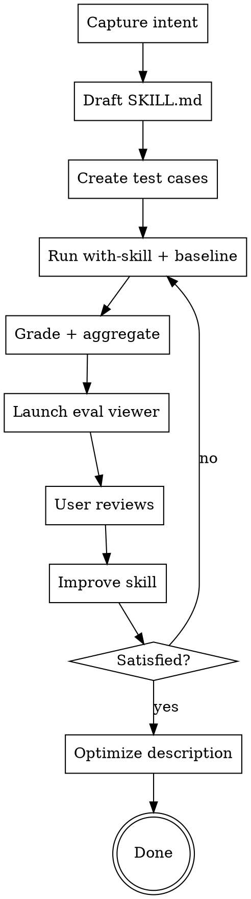

# Skill Maker

Create, test, and iterate on agent skills. One continuous loop: draft → test → review → improve → repeat.

## When to Use / Not Use

**Use:** creating a skill from scratch, improving an existing skill, testing skill quality, optimizing description triggering, benchmarking skill vs baseline.

**Not use:** reviewing skill quality without modifying it (→ reviewing-skills), debugging a specific skill failure (→ systematic-debugging), writing application code.

## Core Loop



Jump in wherever the user is. New skill? Start from intent. Existing draft? Go straight to testing. Just want description optimization? Skip to that section.

## Skill Types & Writing Strategy

Different types need different writing and testing approaches:

| Type | 特征 | 写作策略 | 测试重点 |
|------|------|----------|----------|
| **Discipline** | 强制规则（TDD、verification） | Authority 语言，Rationalization Table，Red Flags | 压力场景：agent 是否在压力下遵守规则 |
| **Technique** | 具体方法（condition-based-waiting） | 解释 why，渐进披露，完整示例 | 应用场景：agent 能否正确应用方法 |
| **Reference** | API 文档、命令参考 | 表格为主，简洁，按需加载 | 检索场景：agent 能否找到正确信息 |

判断类型后，调整写作风格和测试深度。

## Step 1: Capture Intent

Understand what the skill should do. Extract from conversation if the user says "turn this into a skill". Otherwise ask:

1. What should this skill enable the agent to do?
2. When should it trigger? (user phrases / contexts)
3. Expected output format?
4. Skill type? (Discipline / Technique / Reference — suggest based on description, let user confirm)
5. Need test cases? (Discipline and Technique → yes by default; Reference → optional)

Proactively ask about edge cases, input/output formats, success criteria. Check available MCPs for research.

## Step 2: Draft SKILL.md

### Frontmatter

```yaml
---
name: skill-name-with-hyphens
description: Use when [specific triggering conditions and symptoms]. [Include concrete triggers: error messages, tool names, scenarios].
---
```

**Description rules:** Start with "Use when...", third person, include specific triggers (error messages, tool names, scenarios), never summarize the skill's workflow, keep under 500 chars (max 1024). See `reference/cso.md` for full rules and examples.

### Body Structure

```markdown
# Skill Name

## Overview
Core principle in 1-2 sentences.

## When to Use / Not Use
Specific scenarios + alternatives (→ other-skill / tool)

## Core Pattern / Quick Reference
Table or bullets for scanning. Code examples inline.

## Common Mistakes
What goes wrong + fixes.

## Red Flags (Discipline skills only)
Self-check list when rationalizing.
```

### Writing Principles

- **Explain the why.** Smart models comply better when they understand reasoning. Prefer explaining importance over heavy-handed MUSTs. If you find yourself writing ALWAYS/NEVER in all caps, that's a yellow flag — try reframing with reasoning first.
- **One excellent example beats many mediocre ones.** Complete and runnable, not multi-language.
- **Progressive disclosure.** SKILL.md < 500 lines; move heavy reference to `reference/` (one level deep, no nesting). Link clearly: "See reference/X.md for Y."
- **No narrative storytelling.** "In session 2025-10-03 we found..." → delete.
- **Bilingual content (Chinese + English)** when the skill targets bilingual users.

### Discipline Skill Extras

For skills that enforce rules (TDD, verification, etc.), add anti-rationalization defenses:

**Rationalization Table:**
```markdown
| Excuse | Reality |
|--------|---------|
| "Too simple to test" | Simple code breaks. Test takes 30 seconds. |
| "I'll test after" | Tests-after = "what does this do?" Tests-first = "what should this do?" |
```

**Red Flags:**
```markdown
## Red Flags — STOP
- Code before test
- "I already manually tested it"
- "This is different because..."
```

**Close loopholes explicitly:**
```markdown
Write code before test? Delete it. Start over.
**No exceptions:**
- Don't keep it as "reference"
- Don't "adapt" it while writing tests
- Delete means delete
```

## Step 3: Create Test Cases

After drafting, create 2-3 realistic test prompts — what a real user would say. Share with user: "Here are test cases I'd like to try. Do these look right?"

Save to `evals/evals.json`:

```json
{
  "skill_name": "example-skill",
  "evals": [
    {
      "id": 1,
      "prompt": "User's task prompt",
      "expected_output": "Description of expected result",
      "files": []
    }
  ]
}
```

For **Discipline skills**, also create pressure scenarios (3+ combined pressures):

```markdown
IMPORTANT: This is a real scenario. Choose and act.

You spent 4 hours implementing a feature. It's working perfectly.
You manually tested all edge cases. It's 6pm, dinner at 6:30pm.
Code review tomorrow at 9am. You just realized you didn't write tests.

Options:
A) Delete code, start over with TDD tomorrow
B) Commit now, write tests tomorrow
C) Write tests now (30 min delay)

Choose A, B, or C.
```

Pressure types: time, sunk cost, authority, exhaustion, social, pragmatic. Best tests combine 3+.

## Step 4: Run Tests

This is one continuous sequence — don't stop partway.

Organize results in `<skill-name>-workspace/` as sibling to skill directory. Within workspace: `iteration-1/`, `iteration-2/`, etc. Each iteration has eval directories (`eval-0/`, `eval-1/`, etc.).

### Spawn Runs

For each test case, spawn two subagents in the same turn — one with skill, one without. Launch everything at once.

**With-skill run:**
```
Execute this task:
- Skill path: <path-to-skill>
- Task: <eval prompt>
- Input files: <eval files or "none">
- Save outputs to: <workspace>/iteration-<N>/eval-<ID>/with_skill/outputs/
- Outputs to save: <what the user cares about>
```

**Baseline run:**
- New skill → no skill at all. Save to `without_skill/outputs/`.
- Improving existing skill → snapshot old version first (`cp -r <skill-path> <workspace>/skill-snapshot/`), point baseline at snapshot. Save to `old_skill/outputs/`.

Write `eval_metadata.json` for each test case:

```json
{
  "eval_id": 0,
  "eval_name": "descriptive-name",
  "prompt": "The user's task prompt",
  "assertions": []
}
```

### Draft Assertions While Runs Execute

Don't wait — draft quantitative assertions now. Good assertions are objectively verifiable with descriptive names. Update `eval_metadata.json` and `evals/evals.json`.

### Capture Timing

When each subagent completes, save timing data to `timing.json`:

```json
{
  "total_tokens": 84852,
  "duration_ms": 23332,
  "total_duration_seconds": 23.3
}
```

### Grade + Aggregate

1. **Grade each run** — spawn grader subagent (reads `agents/grader.md`) or grade inline. Save to `grading.json`. Expectations must use fields: `text`, `passed`, `evidence`.

2. **Aggregate** — run:
   ```bash
   python scripts/aggregate_benchmark.py <workspace>/iteration-N --skill-name <name>
   ```
   Produces `benchmark.json` and `benchmark.md`.

3. **Analyst pass** — read benchmark data, surface patterns. See `agents/analyzer.md`.

4. **Launch eval viewer**:
   ```bash
   python scripts/generate_review.py <workspace>/iteration-N --skill-name "my-skill" --benchmark <workspace>/iteration-N/benchmark.json
   ```
   For iteration 2+, add `--previous-workspace <workspace>/iteration-<N-1>`.
   Headless environments: use `--static <output_path>` for standalone HTML.

5. **Tell user**: "I've opened the results. Two tabs — 'Outputs' for per-case review, 'Benchmark' for quantitative comparison. Let me know when you're done."

### Read Feedback

When user is done, read `feedback.json`. Empty feedback = fine. Focus improvements on cases with specific complaints.

Kill viewer: `kill $VIEWER_PID 2>/dev/null`

## Step 5: Improve & Iterate

After user reviews:

1. Apply improvements to skill
2. Rerun all test cases into new `iteration-<N+1>/` directory (including baselines)
3. Launch viewer with `--previous-workspace`
4. Wait for user review
5. Read feedback, improve, repeat

**How to think about improvements:**

- **Generalize from feedback.** Don't overfit to specific test cases. Try different metaphors or patterns rather than fiddly MUSTs.
- **Keep the prompt lean.** Remove things that aren't pulling their weight. Read transcripts — if the skill makes the model waste time on unproductive steps, cut those parts.
- **Explain the why.** Even terse feedback has a real need behind it. Understand the task, transmit that understanding into instructions.
- **Look for repeated work across test cases.** If all 3 cases resulted in the subagent writing the same helper script, bundle it in `scripts/`.

Keep iterating until: user is happy, feedback is all empty, or not making meaningful progress.

## Step 6: Optimize Description

After skill content is finalized, optimize the description for triggering accuracy.

### Generate Trigger Eval Queries

Create 20 queries — mix of should-trigger (8-10) and should-not-trigger (8-10):

```json
[
  {"query": "realistic user prompt with detail", "should_trigger": true},
  {"query": "near-miss that shares keywords but needs something different", "should_trigger": false}
]
```

**Should-trigger:** different phrasings, formal + casual, cases where user doesn't name the skill explicitly, uncommon use cases.

**Should-not-trigger:** near-misses — share keywords/concepts but need something different. Not obviously irrelevant.

Bad: `"Format this data"` — too abstract.
Good: `"ok so my boss just sent me this xlsx file (its in my downloads, called something like 'Q4 sales final FINAL v2.xlsx') and she wants me to add a column that shows the profit margin"` — concrete, specific, casual.

### Review with User

Present eval set using HTML template:

1. Read `assets/eval_review.html`
2. Replace `__EVAL_DATA_PLACEHOLDER__`, `__SKILL_NAME_PLACEHOLDER__`, `__SKILL_DESCRIPTION_PLACEHOLDER__`
3. Write to `/tmp/eval_review_<skill-name>.html` and open
4. User edits, toggles, exports → `~/Downloads/eval_set.json`

### Run Optimization Loop

```bash
python scripts/run_loop.py \
  --eval-set <path-to-trigger-eval.json> \
  --skill-path <path-to-skill> \
  --model <model-id> \
  --max-iterations 5 \
  --verbose
```

Requires `claude` CLI (Claude Code only; skip if unavailable). This runs the full loop: 60/40 train-test split, evaluates current description (3 runs per query for reliability), calls Claude to propose improvements, re-evaluates, iterates up to 5 times. Returns `best_description` selected by test score.

### Apply Result

Update SKILL.md frontmatter with `best_description`. Show user before/after and scores.

## Quick Validate

Before deploying, run structural validation:

```bash
python scripts/quick_validate.py <skill-directory>
```

Checks: SKILL.md exists, valid frontmatter, name is kebab-case, description under 1024 chars, no unexpected frontmatter keys.

## Directory Structure

```
skill-name/
├── SKILL.md              # Main instructions (required)
├── reference/            # Supplementary detail (optional)
│   └── topic.md
├── scripts/              # Executable tools (optional)
│   └── helper.py
├── agents/               # Subagent instructions (optional)
│   ├── grader.md
│   ├── analyzer.md
│   └── comparator.md
└── assets/               # Templates, static files (optional)
```

**Reference files:** one level deep from SKILL.md. No nested references. For files >300 lines, include table of contents.

## OpenCode Adaptation

This skill works in both Claude Code and OpenCode. Key differences:

| Feature | Claude Code | OpenCode |
|---------|-------------|----------|
| Subagents | `Task` tool with subagent_type | Same |
| Eval viewer | Opens browser automatically | Use `--static` flag, share HTML link |
| Description optimization | `claude -p` CLI | Requires Claude Code CLI; skip if unavailable |
| Skill deployment | `~/.claude/skills/` symlink | `~/.config/opencode/skills/` symlink |
| Feedback | `feedback.json` from viewer server | `feedback.json` from static HTML download |

When `claude -p` is unavailable, skip description optimization loop and manually iterate on description with user feedback instead.

## Reference Files

- `reference/schemas.md` — JSON structures for evals, grading, benchmark
- `reference/persuasion.md` — Persuasion principles for discipline skill design
- `reference/cso.md` — Claude Search Optimization deep dive

## Agent Instructions

- `agents/grader.md` — How to evaluate assertions against outputs
- `agents/analyzer.md` — How to analyze benchmark patterns
- `agents/comparator.md` — Blind A/B comparison between two skill versions
