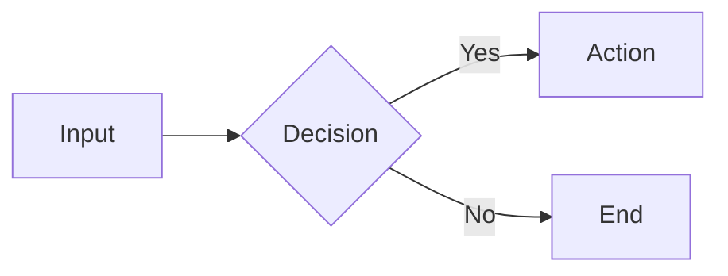

# Writing Markdown

Markdown has no universal style — every team, every agent, writes it differently. This skill provides one consistent default so output is predictable and professional. Project-specific rules always override this.

## When to Use / Not Use

**Use:** writing or editing any .md file — documentation, README, CHANGELOG, design docs, guides, comments that become docs.

**Not use:** project has its own style guide (follow that instead), writing non-markdown content, user explicitly requests a different style.

**Priority:** project style guide > this skill > no guide.

## Quick Reference

### Structure

| Rule | Do | Don't | Why |
|------|----|-------|-----|
| Headings | ATX `#`, numbered `1.` / `1.1` (e.g. `## 1. Overview`, `### 1.1 Background`) | Underline `===`/`---`, Chinese 一二三, bare numbers without period (`## 1 Overview`) | ATX is unambiguous; period after number is standard; bare numbers confuse parsers |
| Heading levels | `#` → `##` → `###`, no skips | Jump `#` → `####` | Skipped levels break TOC generation and accessibility |
| Heading text | Sentence case (English), natural phrasing (Chinese), no trailing punctuation | ALL CAPS, period at end | Consistent casing reads naturally; punctuation adds noise |
| Document title | First `#` heading, appears once | Multiple `#` headings | Single H1 defines document scope for parsers and SEO |
| Sections | Blank line before AND after heading | Heading directly above text/code | Blank lines are required by CommonMark; omitting them breaks renderers |

### Lists

| Rule | Do | Don't | Why |
|------|----|-------|-----|
| Unordered | `-` (hyphen) | `*` or `+` | One marker = no mixing; hyphen is most common |
| Ordered | `1.` for all items | `2.`, `3.` manually | Renderers auto-number; all-`1.` survives reordering |
| Task list | `- [ ]` unchecked, `- [x]` checked | Task syntax for non-task items | Task lists are for actionable items with binary status |
| Nesting | 2 spaces per level | Mix tab/space, 4-space indent | 2-space is the GFM standard; consistency avoids render bugs |
| List continuation | Blank line before new list type | Unordered → ordered without break | Different list types need separation to render correctly |

### Code

| Rule | Do | Don't | Why |
|------|----|-------|-----|
| Fenced blocks | Always specify language: ` ```python ` | Bare ` ``` ` | Syntax highlighting depends on language hint; bare fences get no color |
| Inline code | `` `command` `` for commands/API names | Bold for code, code for emphasis | Code backticks signal "this is literal" — bold signals importance |
| File paths | `` `src/main.ts` `` | Plain text or italic | Monospace distinguishes paths from prose |

### Diagrams

Priority order by use case:

| Scenario | Format | Why |
|----------|--------|-----|
| Flowchart / sequence / class | **Mermaid** | GFM native render, widest support, no external server |
| Professional UML (detailed) | **PlantUML** | Richer UML semantics than Mermaid; needs render server |
| Pixel-perfect custom graphics | **SVG** (inline or file) | Full visual control; trade-off: less semantic than Mermaid |
| Explicitly requested / no render env | **ASCII** | Universal plain-text readability; no renderer needed |

Mermaid example:



### Tables

| Rule | Do | Don't | Why |
|------|----|-------|-----|
| Header row | Always include | Headerless tables | Headers are required by GFM; headerless tables render as text |
| Column alignment | Align pipes `|` vertically | Ragged pipes | Aligned pipes are readable and diff-friendly in source |
| Alignment markers | `:---`, `:---:`, `---:` as needed | Skip when alignment matters | Markers control render alignment; omitting = all left |
| Wide tables | Split or use a list | Force 6+ columns | Wide tables break on mobile and narrow viewports |

### Images & Attachments

| Rule | Do | Don't | Why |
|------|----|-------|-----|
| Alt text | Always: `` | `` | Alt text is required for accessibility; screen readers skip empty alt |
| Path | Relative: `./images/fig1.png` | Absolute paths | Relative paths survive directory moves and work across machines |
| Directory | `assets/` or `images/` under doc root | Scatter in root | Centralized images are discoverable and maintainable |
| Screenshots | Describe what's shown in alt text | "screenshot" alone | "screenshot" tells nothing; describe the content |

### Links & References

| Scenario | Format | Example |
|----------|--------|---------|
| Short doc / most cases | Inline link | `[text](url)` |
| Long doc / many refs | Footnote `[^1]` → `[^1]: url` at bottom | `According to the spec[^1]...` then `[^1]: url` at bottom |
| Cross-reference in repo | Relative path | `[API](./api.md)` |
| External URL | Full URL in link | `[React](https://react.dev)` |

### Chinese Typography

| Rule | Do | Don't | Why |
|------|----|-------|-----|
| CJK ↔ Latin/number | Add space | `使用React` → `使用 React` | Visual balance; without space, characters visually collide |
| CJK punctuation | Full-width `，。！？：；` | Half-width in Chinese text | Full-width matches CJK character width; half-width looks broken |
| Number + unit | Half-width number + space + unit | `10GB` → `10 GB` | Numbers are half-width; space separates from CJK unit |
| English in Chinese | English rules inside English | `使用 JavaScript 的 Array` | Each script follows its own conventions internally |
| Ellipsis | `……` (six dots) | `...` (three dots) in Chinese | Chinese ellipsis is six dots (two 3-dot characters) |
| Em dash | `——` (two em-dash) | `--` or `—` in Chinese | Chinese em dash is two full-width dashes |

### Spacing & Blank Lines

| Location | Blank lines |
|----------|-------------|
| Before heading | 1 |
| After heading | 1 |
| Between paragraphs | 1 |
| Before/after code block | 1 |
| Before list | 1 |
| Between list items (same list) | 0 |
| Between different lists | 1 |
| Before/after table | 1 |

## Common Pitfalls

| Pitfall | Fix |
|---------|-----|
| Mixing `*` and `-` in same list | Use `-` only |
| Bare code fence without language | Always add language identifier |
| `` — no alt text | Write descriptive alt text |
| `使用React开发` — no CJK-Latin space | `使用 React 开发` |
| Skipping heading levels | Go `#` → `##` → `###` sequentially |
| Multiple `#` headings in one file | Only one `#` per document |
| HTML tags for layout | Use markdown tables/lists instead |
| Absolute image paths | Use relative paths |
| `1. 2. 3.` manual numbering | Use all `1.` — renderers auto-number |

## Self-Check Checklist

After writing or editing any .md file, verify:

- [ ] Headings: ATX `#` style, numbered, no skipped levels, one `#` per file
- [ ] Lists: `-` for unordered, `1.` for ordered, consistent 2-space indent
- [ ] Code blocks: language specified on every fence
- [ ] Diagrams: Mermaid by default; PlantUML/SVG/ASCII only when justified
- [ ] Tables: header row present, pipes aligned
- [ ] Images: alt text present, relative path
- [ ] Links: inline preferred, footnotes for long docs
- [ ] Chinese: CJK-Latin space, full-width punctuation, proper ellipsis/dash
- [ ] Blank lines: consistent per spacing table above
- [ ] No HTML tags unless absolutely necessary
- [ ] File ends with a single newline

## Optional Linter Verification

For extra confidence, run linters after writing. **Optional** — the rules above are the primary guide.

```bash
# markdownlint — syntax & structure
npx markdownlint-cli path/to/file.md

# lint-md — Chinese-specific rules (auto-fix)
npx lint-md path/to/file.md --fix

# AutoCorrect — CJK typography (auto-fix)
npx autocorrect path/to/file.md --fix
```

Detailed rules with examples and linter config → `reference/style-rules.md`
